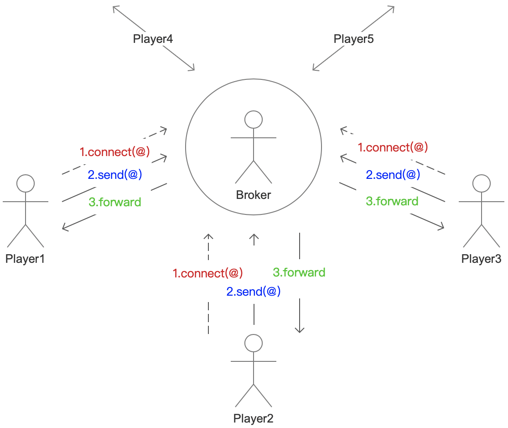
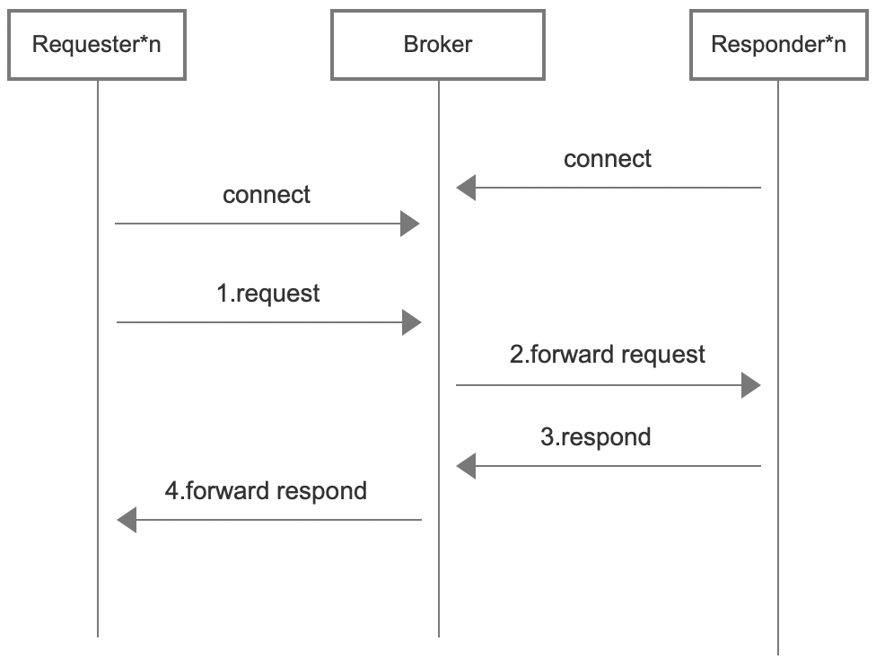

<h1 align="center" style="text-align:center;">
  Socket.D
</h1>
<p align="center">
	<strong>Network application protocol based on event and semantic message streams</strong>
</p>

<p align="center">
	<a href="https://socketd.noear.org/">https://socketd.noear.org</a>
</p>

<p align="center">
    <a target="_blank" href="https://search.maven.org/artifact/org.noear/socketd">
        
    </a>
    <a target="_blank" href="https://www.apache.org/licenses/LICENSE-2.0.txt">
		
	</a>
   <a target="_blank" href="https://www.oracle.com/java/technologies/javase/javase-jdk8-downloads.html">
		
	</a>
    <a target="_blank" href="https://www.oracle.com/java/technologies/javase/jdk11-archive-downloads.html">
		
	</a>
    <a target="_blank" href="https://www.oracle.com/java/technologies/javase/jdk17-archive-downloads.html">
		
	</a>
    <a target="_blank" href="https://www.oracle.com/java/technologies/javase/jdk21-archive-downloads.html">
		
	</a>
    <br />
    <a target="_blank" href='https://gitee.com/noear/socketd/stargazers'>
        
    </a>
    <a target="_blank" href='https://github.com/noear/socketd/stargazers'>
        
    </a>
</p>

<br/>
<p align="center">
	<a href="https://jq.qq.com/?_wv=1027&k=kjB5JNiC">
	</a>
</p>

##### Language: English | [中文](README_CN.md) 

<hr />

One user said, "Socket.D is to Socket what Vue is to Js and Mvc is to Http."

### Main Features

* Event-based, where each message is an event (or instruction)
* Semantically, each message has meta-information
* Language independent, binary communication protocol (tcp, ws, udp supported). Support multi-language, multi-platform
* Disconnection reconnection, automatic connection restoration
* Multiplexing
* Two-way communication, single link two-way listening and sending
* Auto-split, data over 16Mb will be automatically split and reassemble (except udp)
* Simple interface


### Simple comparison with http and websocket

| comparison               | socket.d | http | websocket(ws) | remarks          |
|--------------------------|-------|------|-------------|------------------|
| Send (Qos0)              | Yes   | No   | Yes            | Suitable for monitoring buried point, log report      |
| SendAndRequest (Qos1)    | Yes      | Yes  | No           | Suitable for immediate reply confirmation         |
| sendAndSubscribe (stream) | Yes      | No   | No           | Suitable for video playback and so on, block streaming acquisition |
| Reply or respond         | Yes      | Yes  | No           |                  |
| Single connection two-way communication                 | Yes      | No   | Yes（Inconvenient to use）        | Send and listen to each other. Suitable for reverse call service  |
| Data sharding                     | Yes      | /    | No           | Suitable for large file upload          |
| Disconnection automatically reconnect                  | Yes      | /    | No           |                  |
| There is meta or header information                 | Yes      | Yes  | No           |                  |
| Basic transport protocol                   | tcp, udp, ws | tcp  | http        |                  |


### Applicable scene

It can be used for MSG, RPC, IM, MQ and other scenarios, and can replace Http, Websocket, gRpc and other protocols. Such as the connection between the mobile device and the server, such as some microservice scenarios, etc.


### Simple protocol description（ See more here：[《Protocol documentation》](protocol.md) ）


* Connection address style

```
sd:tcp://19.10.2.3:9812/path?u=noear&t=1234
sd:udp://19.10.2.3:9812/path?u=noear&t=1234
sd:ws://19.10.2.3:1023/path?u=noear&t=1234
```


* Frame code structure

```
//udp only <2k
[len:int][flag:int][sid:str(<64)][\n][event:str(<512)][\n][metaString:str(<4k)][\n][data:byte(<16m)]
```

* Instruction stream

| Flag      | Server                               | Client                                                | 
|-----------|--------------------------------------|-------------------------------------------------------|
| Unknown   | ::close()                            | ::close()                                             | 
| Connect   | /                                    | c(Connect)->s::onOpen(),s(Connack?)->c::onOpen() | 
| Connack   | ->s::onOpen(),s(Connack?)->c         | /                                                     | 
| Ping      | /                                    | c(Ping)->s(Pong)->c                                   | 
| Pong      | ->s(Pong)->c                         | /                                                     | 
| Close     | s(Close)->c                          | c(Close)->s                                           | 
| Alarm     | s(Alarm)->c                          | c(Alarm)->s                                           | 
| Message   | s(Message)->c                        | c(Message)->s                                         | 
| Request   | s(Request)->c(Reply or ReplyEnd)->s  | c(Request)->s(Reply or ReplyEnd)->c                   |  
| Subscribe | s(Subscribe)->c(Reply...ReplyEnd)->s | c(Subscribe)->s(Reply...ReplyEnd)->c                  | 
| Reply     | ->s(Reply)->c                        | ->c(Reply)->s                                         | 
| ReplyEnd  | ->s(ReplyEnd)->c                     | ->c(ReplyEnd)->s                                      | 

```
//The reply acceptor registration in the channel is removed after the reply is completed
```


### Get started and learn quickly

* Learning

Please click：[《快速入门与学习》](_docs/)。Languages and platforms other than Java will follow soon (interested students are welcome to join the community)

* Understanding of planning situation

| Language or platform  | Client side | Server side | Remarks                   |
|--------|-----|----|----------------------|
| java   | Completed | Completed  | Support tcp, udp, ws communication architecture |
| js     | Under development | /  | Supports ws communication architecture           |
| python | Under development | /  | Supports ws communication architecture           |
| Other     | On the plan | On the plan  |                      |


### Join a community exchange group

| QQ communication group：870505482                       | Wechat Communication group (input: SocketD when applying)                   |
|---------------------------|----------------------------------------|
|        |  

In the communication group, "nanny level" support and help are provided. Technical training and consultancy services are also available if required

### The first program: Hello World!

```java
public class Demo {
    public static void main(String[] args) throws Throwable {
        //::Starting the server
        SocketD.createServer("sd:tcp")
                .config(c -> c.port(8602))
                .listen(new SimpleListener(){
                    @Override
                    public void onOpen(Session session) throws IOException {
                        //authentication
                        if("1b0VsGusEkddgr3d".equals(session.param("token")) == false){
                            session.close();
                        }
                    }
                    @Override
                    public void onMessage(Session session, Message message) throws IOException {
                        //print
                        System.out.println(message);
                        
                        if(message.isRequest() || message.isSubscribe()){
                            //Reply
                            session.replyEnd(message, new StringEntity("And you too."));
                        }
                    }
                })
                .start();

        Thread.sleep(1000); //Let's make sure the server starts up
        
        //::Open the client session
        Session session = SocketD.createClient("sd:tcp://127.0.0.1:8602/?token=1b0VsGusEkddgr3d")
                .open();


        Entity message = new StringEntity("Hello wrold!").meta("user","noear");
        
        //send
        session.send("/demo", message);
        //Send and request (and, wait for a reply)
        Entity response = session.sendAndRequest("/demo", message);
        //Send and subscribe (and, receive a stream of replies)
        session.sendAndSubscribe("/demo", message, stream->{
            
        });
    }
}
```

### Diagram of Socket.D Broker cluster architecture

* Structure



* Sequence




