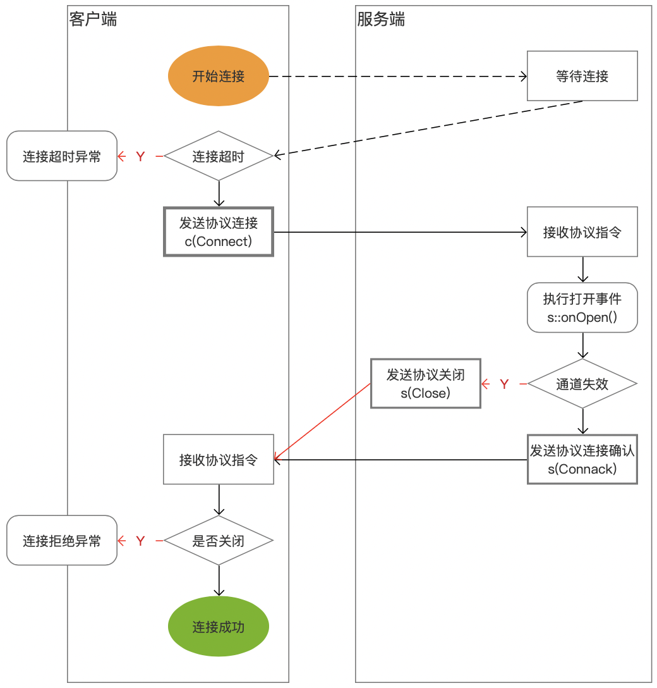
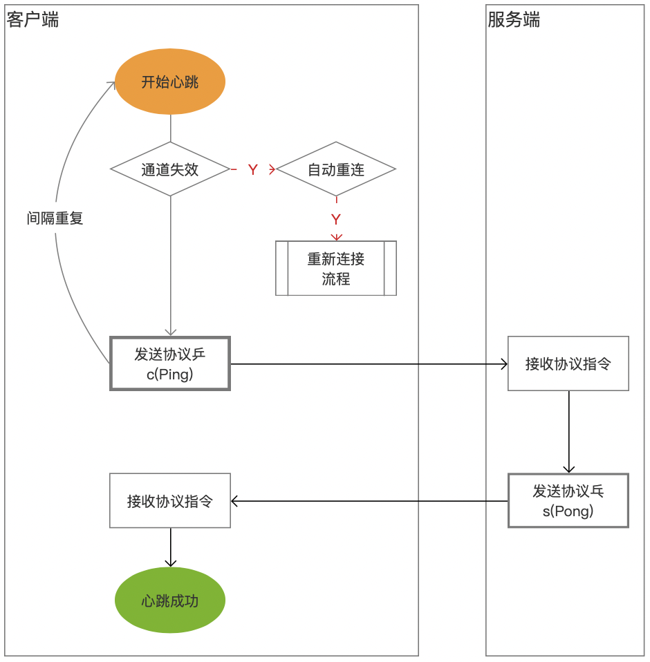

# Socket.D 应用协议文档（未完待续）

## 一、协议概要


### 1、连接地址风格

```
sd:tcp://19.10.2.3:9812/path?u=noear&t=1234
sd:udp://19.10.2.3:9812/path?u=noear&t=1234
sd:ws://19.10.2.3:1023/path?u=noear&t=1234
```

说明:

| 应用协议 | 传输协议 | 说明                       |
|------|------|--------------------------|
| sd   |      | 表示 socket.d 应用协议，代表了帧码格式 |
|      | tcp  | 表过使用 tcp 传输数据            |
|      | udp  | 表示使用 udp 传输数据            |
|      | ws   | 表示使用 ws (websocket) 传输数据 |


传输协议选择建议：

* 弱网络且数据包很小。可以考虑 udp
* 如果有 web 前端开发。可以考虑 ws
* 其它随意


### 2、帧码结构

* 帧的逻辑结构

```
frame: {flag, message: {sid, event, entity: { meta, data}}}
```

帧的数据逻辑结构：帧里有标志和消息；消息里有流标识、事件、实体；实体里有元信息和数据。

* 完整的标准帧码

```
//udp only <2k
[len:int][flag:int][sid:str(<64)][\n][event:str(<512)][\n][metaString:str(<4k)][\n][data:byte(<16m)]
```

| 字段         | 类型     | 大小  | 说明                                        |
|------------|--------|-----|-------------------------------------------|
| len        | int    | 4字节 | 帧长度（包括它自己的 4字节）                           |
| flag       | int    | 4字节 | 标志（相当于指令）                                 |
| sid        | String | 64字节以内 | 流标识（做为帧的交互关联。如，握手、分片、答复）                  |
| event      | String | 512字节以内 | 事件（也可理解为路径、命令）                            |
| metaString | String | 4Kb以内 | 元信息字符串（使用 uri queryString 编码格式。例：u=a&n=1） |
| data       | byte[] | 16Mb以内 | 数据                                        |

注意：当使用 udp 传输时，帧长度不能超过 2k （实际不能超过 1.4k ）

* 简化的辅助帧码（Ping, Pong, Close），取消了 message 部分

```
[len:int][flag:int]
```

### 3、指令流

| Flag         | Value | Server                               | Client                                                | 
|--------------|-------|--------------------------------------|-------------------------------------------------------|
| Unknown      | 0     | ::close()                            | ::close()                                             | 
| Connect      | 10    | /                                    | c(Connect)->s::onOpen(),s(Connack?)->c::onOpen() | 
| Connack      | 11    | ->s::onOpen(),s(Connack?)->c         | /                                                     | 
| Ping         | 20    | /                                    | c(Ping)->s(Pong)->c                                   | 
| Pong         | 21    | ->s(Pong)->c                         | /                                                     | 
| Close        | 30    | s(Close)->c                          | c(Close)->s                                           | 
| Message      | 40    | s(Message)->c                        | c(Message)->s                                         | 
| Request      | 41    | s(Request)->c(Reply or ReplyEnd)->s  | c(Request)->s(Reply or ReplyEnd)->c                   |  
| Subscribe    | 42    | s(Subscribe)->c(Reply...ReplyEnd)->s | c(Subscribe)->s(Reply...ReplyEnd)->c                  | 
| Reply        | 48    | ->s(Reply)->c                        | ->c(Reply)->s                                         | 
| ReplyEnd     | 48    | ->s(ReplyEnd)->c                     | ->c(ReplyEnd)->s                                      | 

```
//The reply acceptor registration in the channel is removed after the reply is completed
```

## 二、指令流详解

### 1、连接与握手流

连接与握手，是在客户端打开连接时发生的。这个过程中，sid 会保持不变



### 2、心跳与自动重连流

心跳与自动重连，是平常保持连接活跃性的方式。就像心跳一样，按固定间隔进行跳动，发现连接失效时尝试自动重连



### 3、关闭流

关闭，有两种情况会发现：1，网络中断引起的“链接关闭”；2，服务端或客户端主动调用会话关闭而产生的“协议关闭”


### 4、消息流

消息流，是平常发消息时产生的

* 消息分片


* 消息答复

